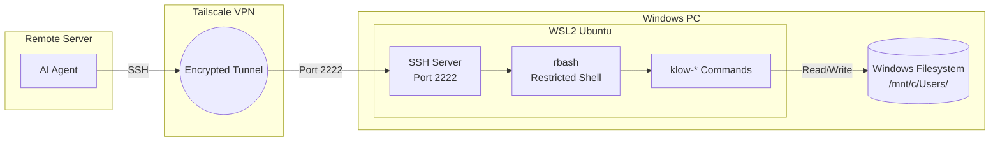
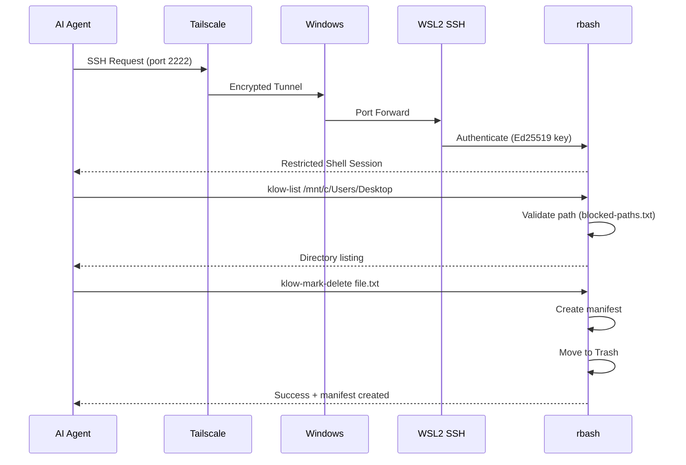
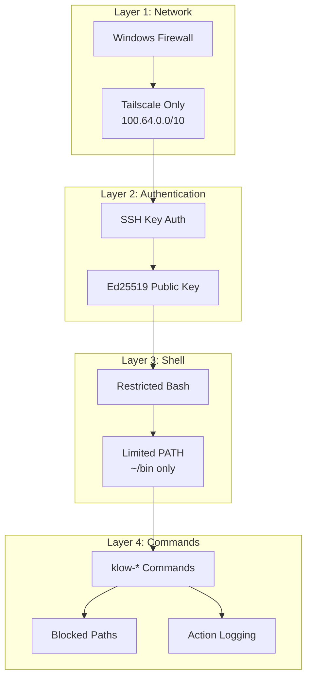
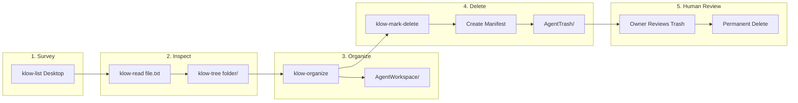

# OpenClaw Windows Organizer Skill

A Claude Code skill that enables an AI assistant to securely access and organize files on a Windows PC via SSH through Tailscale VPN.

## What This Does

Allows an AI agent (like Claude) running on a remote server to:
- Browse and read files on your Windows PC
- Organize files into designated folders
- Mark files for deletion (with manifests explaining why)
- Check system status and schedule shutdowns
- All through a **restricted shell** with only approved commands

## Security Model

- **Tailscale-only access**: SSH only accepts connections from your Tailscale network
- **Restricted shell (rbash)**: Only `klow-*` commands are available
- **Sandboxed paths**: Cannot access system directories or sensitive files
- **Action logging**: All operations logged for review
- **Instant revocation**: One script to completely revoke access

## Architecture



## Connection Flow



## Security Layers



## File Organization Workflow



## Prerequisites

- Windows 10/11 with WSL2 (Ubuntu)
- Tailscale installed on both machines
- SSH key pair for the AI agent

## Quick Setup

### 1. Install WSL2 (if not already)

```powershell
wsl --install -d Ubuntu
```

### 2. Clone and configure

```bash
# In WSL2
git clone https://github.com/SeMmyDennis/openclaw-win-organizer-skill.git
cd openclaw-win-organizer-skill

# Edit setup.sh and set your agent's SSH public key
nano scripts/setup.sh
```

### 3. Run the setup script

```bash
sudo bash scripts/setup.sh
```

### 4. Configure Windows

```powershell
# Run as Administrator

# Set up port forwarding
$wslIP = (wsl hostname -I).Trim().Split(' ')[0]
netsh interface portproxy add v4tov4 listenport=2222 listenaddress=0.0.0.0 connectport=2222 connectaddress=$wslIP

# Add firewall rule (Tailscale only)
New-NetFirewallRule -DisplayName "WSL SSH - Tailscale Only" -Direction Inbound -LocalPort 2222 -Protocol TCP -Action Allow -RemoteAddress 100.64.0.0/10

# Install startup script
Copy-Item windows\start-ssh.vbs "$env:APPDATA\Microsoft\Windows\Start Menu\Programs\Startup\"
```

### 5. Add the skill to your AI agent

Copy `SKILL.md` to your Claude Code skills directory.

## Directory Structure

```
openclaw-win-organizer-skill/
├── SKILL.md              # The skill file for Claude Code
├── README.md             # This file
├── scripts/
│   ├── setup.sh          # Main setup script
│   ├── fix-commands.sh   # Adds command symlinks for rbash
│   └── klow-commands/    # The restricted command set
│       ├── klow-help
│       ├── klow-status
│       ├── klow-list
│       ├── klow-tree
│       ├── klow-read
│       ├── klow-workspace
│       ├── klow-organize
│       ├── klow-mark-delete
│       ├── klow-manifest
│       ├── klow-shutdown
│       ├── klow-shutdown-cancel
│       ├── klow-common.sh
│       └── blocked-paths.txt
└── windows/
    ├── start-ssh.vbs     # Windows startup script
    └── revoke-access.ps1 # Emergency access revocation
```

## Available Commands

| Command | Description |
|---------|-------------|
| `klow-help` | Show all available commands |
| `klow-status` | Check system status (uptime, disk, memory) |
| `klow-list <path>` | List directory contents |
| `klow-tree <path>` | Show directory tree |
| `klow-read <file>` | Read file contents |
| `klow-workspace` | Manage the workspace folder |
| `klow-organize` | File organization tools |
| `klow-mark-delete <file>` | Move file to trash with manifest |
| `klow-manifest` | Create/view deletion manifests |
| `klow-shutdown [min]` | Schedule PC shutdown |
| `klow-shutdown-cancel` | Cancel scheduled shutdown |

## Customization

### Change the Tailscale IP

Update the IP address in `SKILL.md` to match your Windows PC's Tailscale IP:

```bash
tailscale ip -4  # Run on Windows to get your Tailscale IP
```

### Add custom commands

1. Create a new script in `scripts/klow-commands/`
2. Name it `klow-yourcommand`
3. Make it executable: `chmod +x klow-yourcommand`
4. Re-run setup or copy manually to `/home/agent/bin/`

### Modify blocked paths

Edit `scripts/klow-commands/blocked-paths.txt` to add/remove restricted directories.

## Revoking Access

### Temporary (stop SSH)
```bash
wsl -u root service ssh stop
```

### Permanent (full revocation)
```powershell
# Run as Administrator
.\windows\revoke-access.ps1
```

This will:
- Remove the agent user from WSL
- Delete SSH keys
- Remove firewall rules
- Remove port forwarding
- Remove startup scripts

## License

MIT

## Contributing

Issues and PRs welcome! This project aims to make secure AI-assisted file management accessible to everyone.
